

  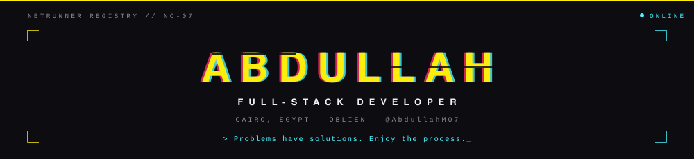

 

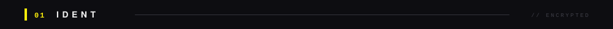

  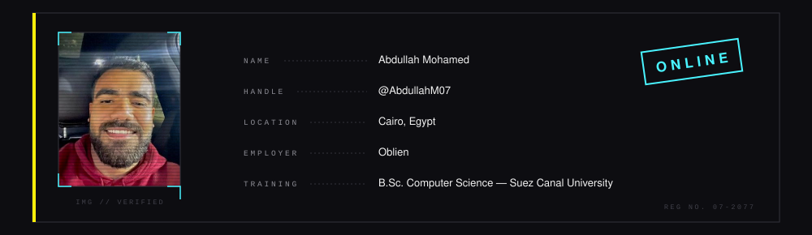

 

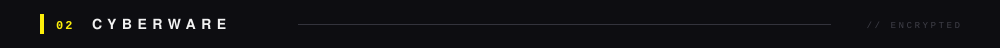

  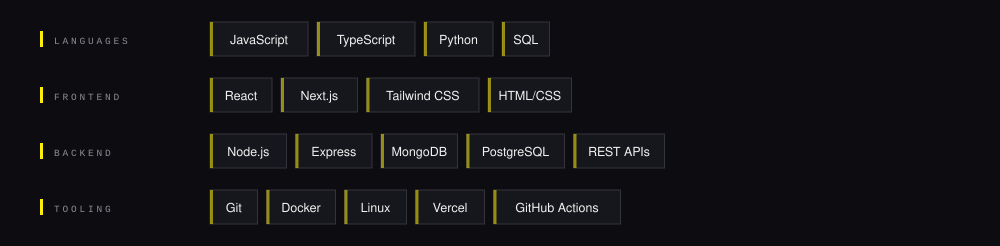

 

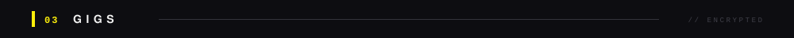

  <a href="https://openship.io">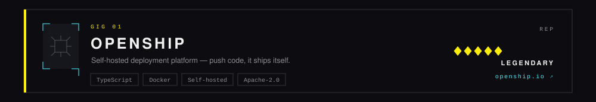</a>
  <a href="https://mindwire.sh">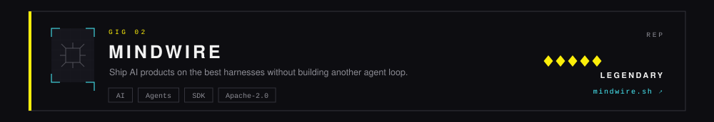</a>

 

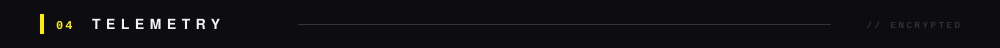

  

 

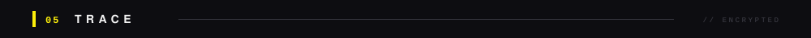

 

  <picture>
    <source media="(prefers-color-scheme: dark)" srcset="https://raw.githubusercontent.com/AbdullahM07/AbdullahM07/output/github-snake-dark.svg"/>
    <source media="(prefers-color-scheme: light)" srcset="https://raw.githubusercontent.com/AbdullahM07/AbdullahM07/output/github-snake.svg"/>
    
  </picture>

 

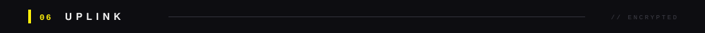

 

  &#160;&#160;&#160;&#160;&#160;&#160;

 

  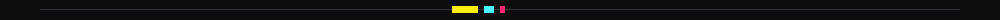
    
  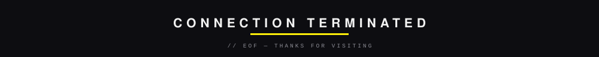

