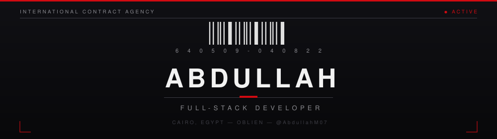
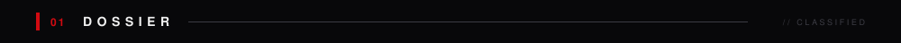
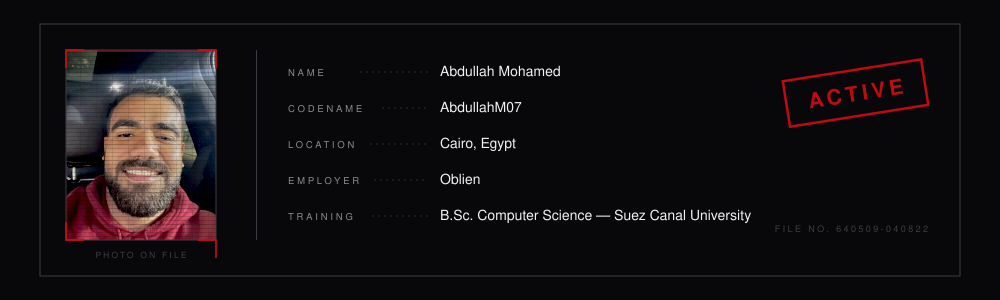
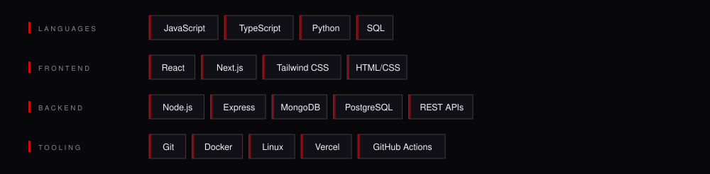
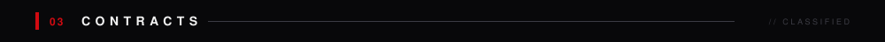
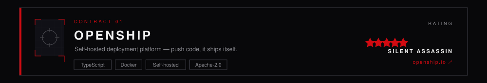
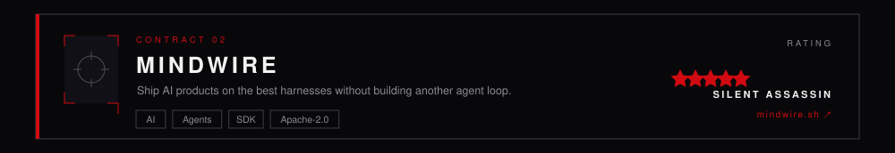
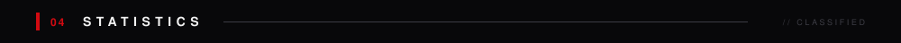
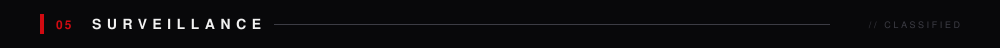

  

 

  

 

  

 

  
  

 

  

 

 

  <picture>
    <source media="(prefers-color-scheme: dark)" srcset="https://raw.githubusercontent.com/AbdullahM07/AbdullahM07/output/github-snake-dark.svg"/>
    <source media="(prefers-color-scheme: light)" srcset="https://raw.githubusercontent.com/AbdullahM07/AbdullahM07/output/github-snake.svg"/>
    
  </picture>

 

 

  &#160;&#160;&#160;&#160;&#160;&#160;

 

  
    
  
   
  

