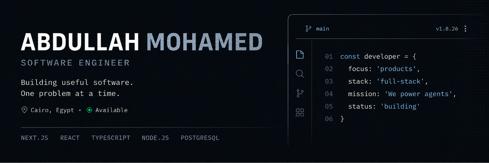

<p align="center">
  Bachelor of Science in Computer Science — Suez Canal University, Egypt
</p>


---

## GitHub Analytics

<p align="center">
  
  
</p>

<p align="center">
  
  
</p>

---

**Connect With Me**

<p align="center">
  <a href="https://www.linkedin.com/in/3bs7"></a>
  <a href="https://github.com/AbdullahM07"></a>
  <a href="https://discord.gg/_3bbs"></a>
</p>

---

<p align="center">Thanks for visiting! Feel free to explore my repositories, collaborate, or reach out if you’d like to work together.</p>
```
